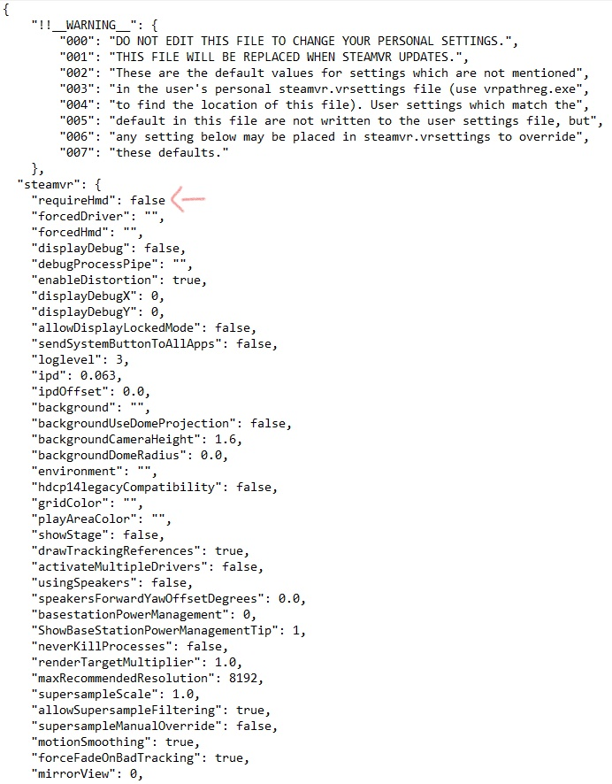

# HTC-vive-tracker

Source : [How to Use the HTC Vive Tracker Without a Vive Headset](https://www.roadtovr.com/how-to-use-the-htc-vive-tracker-without-a-vive-headset/)

Ce documents permet de connecter un ou plusieurs tracker 3.0 à SteamVR. Puis de récupérer les coordonnées des trackers par rapport au lighthouse.

# Appairage des HTC vive trackers 3.0 sans Headset (HDM)

- Matériels :
    - 1 [Station de base SteamVR 2.0](https://www.vive.com/fr/accessory/base-station2/)
    - 1 [Vive tracker 3.0](https://www.vive.com/us/accessory/tracker3/)  
    
    Testé sur Window 11

- Programmes :
    - SteamVR, trouvable sur la plateforme steam
    - Python 3
    - [pyopenvr](https://github.com/cmbruns/pyopenvr), utilisant la commande : pip install opvenvr
    - [triad_openvr](https://github.com/TriadSemi/triad_openvr), télécharger le github 

- Etapes : 
    1. trouver le fichier <mark>default.vrsetting</mark> : 
pour mon cas, le chemin est : C:\Program Files (x86)\Steam\steamapps\common\SteamVR\resources\settings
 
Modifier la valeur de "requiredHmd" en <mark>false</mark>

    Ce changement permet de ne pas avoir à utiliser un casque Vive. En temps normal, pour connecter les trackers, il est nécessaire d'appairer son casque au préalable.

    2. Lancer SteamVR et [appairer le ou les trackers 3.0](https://www.vive.com/fr/support/tracker3/category_howto/pairing-vive-tracker.html) (un seul à été utiliser pour notre essai).

    3. tester le code : python tracker_test.py

    Le programme vous retourne les coordonnées X, Y, Z ainsi que les inclinaisons A, B et C (yaw, pitch, roll)
